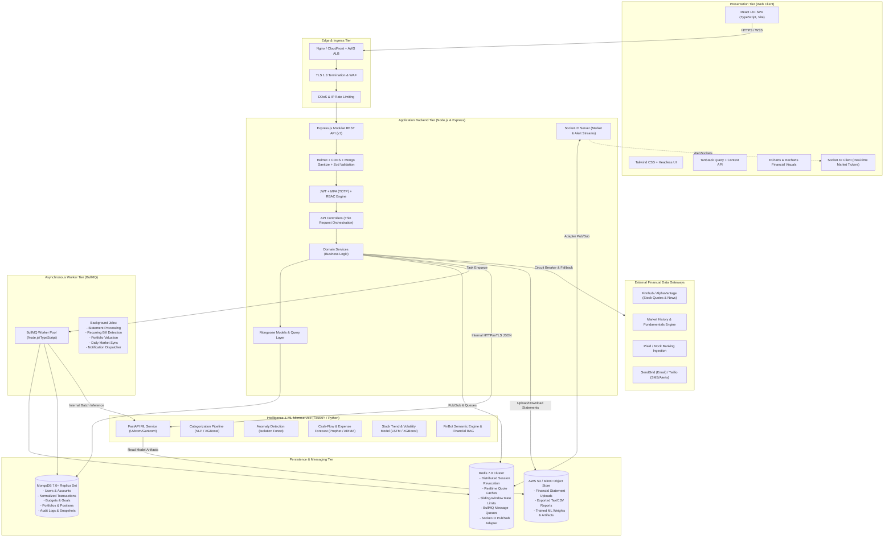
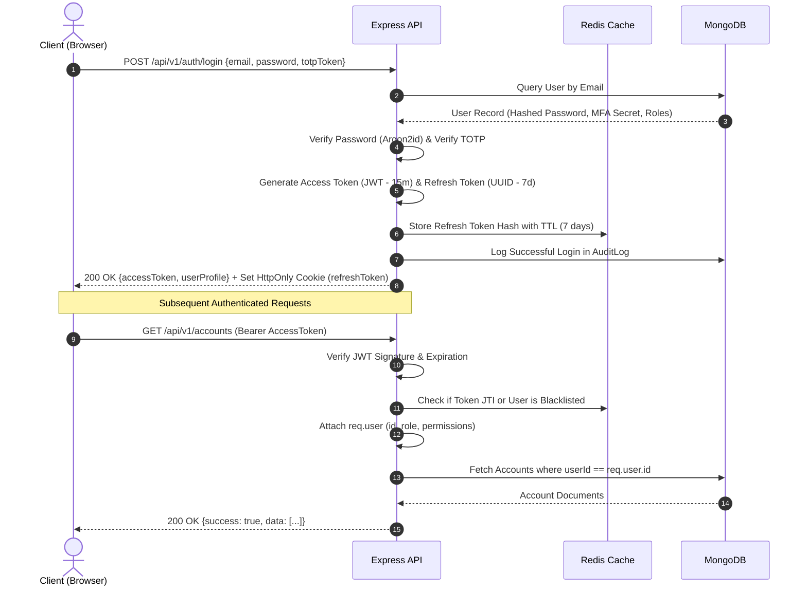
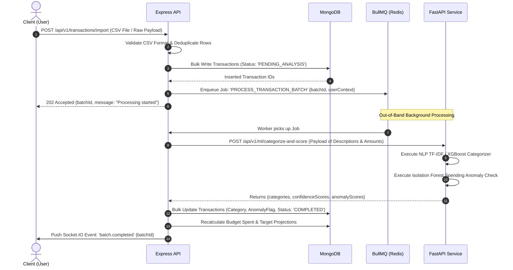

# SMARTFIN AI — System Architecture & Engineering Blueprint

**Personal Finance, Investment & Stock Market Intelligence Platform**  
*Document Version: 1.0.0 | Status: Approved Architecture Specification*

---

## 1. Executive Summary & Vision

**SMARTFIN AI** is an enterprise-grade, cloud-ready, multi-tenant personal finance and investment intelligence platform. It bridges the divide between day-to-day personal financial hygiene (expense tracking, budget management, subscription monitoring, cash-flow forecasting) and advanced market intelligence (stock portfolio tracking, automated technical analysis, ML-driven price forecasting, spending anomaly detection, and conversational AI advisory).

Unlike simplistic CRUD expense trackers, SMARTFIN AI is engineered with:
- **Strict Tiered Isolation**: The user interface never directly interfaces with databases or external financial APIs.
- **High-Throughput Asynchronous Task Pipelines**: Heavy operations (statement ingestion, ML forecasting, market quote polling, recurring bill detection) run out-of-band via distributed background workers.
- **Dedicated Analytical Machine Learning Microservice**: Python/FastAPI microservice running specialized scientific computing libraries (NumPy, Pandas, Scikit-learn, XGBoost, PyTorch) decoupled from the Node.js API runtime.
- **Financial-Grade Security & Integrity**: Zero-trust architecture, multi-factor authentication (MFA/TOTP), role-based access control (RBAC), field-level cryptographic encryption for sensitive financial accounts, comprehensive audit logging, and automated threat mitigation.

---

## 2. High-Level System Architecture

### 2.1 Logical Component Diagram



---

## 3. Strict Architectural Rules & Invariants

1. **Zero Direct Access to Persistence**:
   - The Frontend client will **never** directly connect to MongoDB, Redis, S3, or third-party financial API providers.
   - All client traffic routes strictly through the Node.js/Express API Gateway.
2. **Decoupled Machine Learning Service**:
   - The Python FastAPI service is an **independent, headless microservice**. It does not own the primary user or transaction database; it receives sanitized payloads from the Node.js backend or reads via an authorized internal service token.
   - Can be scaled, containerized, and deployed independently on GPU or compute-optimized infrastructure.
3. **No Secrets in Client Bundles**:
   - External provider API keys (Finnhub, Alpha Vantage, SendGrid, AWS credentials) reside strictly in server environment variables.
   - Any client-side analytics or market requests query `/api/v1/market/*` endpoints, which apply server-side caching, rate limiting, and circuit breaking.
4. **Deterministic Tiering & Layer Isolation**:
   - **Controllers**: Handle HTTP protocol concerns (headers, parsing status codes, input routing).
   - **Validation Schemas (Zod)**: Validate and strip untrusted input before touching services.
   - **Services**: Pure business logic, authorization verification, transaction boundary orchestration.
   - **Data Access Layer (Mongoose)**: Encapsulates MongoDB queries, indexes, projections, and atomic mutations.

---

## 4. Technology Stack Justification & Trade-Offs

| Tier | Technology | Purpose | Strategic Justification |
| :--- | :--- | :--- | :--- |
| **Frontend** | React 18+ (Vite) | Single Page Application Core | Maximum ecosystem stability, rapid HMR build speeds with Vite, tree-shaking, predictable virtual DOM rendering for data-dense tables. |
| **Frontend Language** | TypeScript 5+ | Static Typing | Eliminates runtime type errors across complex financial data contracts, position calculators, and currency arithmetic. |
| **Frontend Styling** | Tailwind CSS | Design System & Styling | High performance atomic utility CSS, zero runtime overhead, effortless dark/light fintech theme switching. |
| **Data Fetching** | TanStack Query v5 | Server State Management | Automatic background refetching, query caching, optimistic UI updates for transactions, and window-focus sync. |
| **Visualizations** | ECharts & Recharts | Financial Charting | High-performance canvas/SVG rendering for candlestick stock charts, area fill net-worth charts, and interactive portfolio donut diagrams. |
| **Backend API** | Node.js & Express | Core Application Gateway | Event-driven I/O model handles high-concurrency client requests; mature ecosystem for middleware, auth, and financial data normalization. |
| **Backend Language**| TypeScript (Strict) | Enterprise Typing | Enforces strict null checks, exhaustive matching on transaction types, and shared DTO interfaces. |
| **Database** | MongoDB 7.0+ | Document Data Store | Flexible schema handles polymorphic financial accounts, varied transaction metadata, and native time-series collections for net-worth and market history. |
| **Cache & Queues** | Redis 7.0+ | Distributed Cache & Broker | In-memory microsecond latency for rate limiting, JWT token revocation tracking, stock quote caching, and BullMQ queue management. |
| **Queue Manager** | BullMQ | Distributed Job Processing | Redis-backed robust job queue with automatic retries, backoff strategies, delayed jobs, and progress telemetry. |
| **ML Engine** | Python 3.11 + FastAPI| Data Science & Analytics | Industry-standard scientific stack (Pandas, Scikit-learn, XGBoost, PyTorch) with asynchronous high-throughput ASGI server. |
| **Realtime** | Socket.IO | Bi-directional Communication| Fallback transport support (WebSockets + polling), rooms/namespaces for ticker subscriptions and instant user alerts. |

---

## 5. Subsystem Architecture

### 5.1 Personal Finance & Ingestion Subsystem
- **Account Normalization**: Multi-currency account abstractions (Checking, Savings, Credit Card, Brokerage, Loan, Crypto).
- **Transaction Pipeline**:
  ```
  Statement Ingestion (CSV/JSON) 
    → File Sanitization & Parser 
    → Duplicate Hash Deduplication (MD5/SHA256 of Account+Date+Amount+Payee)
    → Bulk Insertion Pipeline
    → Async Event Trigger ("transactions.ingested")
    → BullMQ Dispatches to FastAPI for Categorization & Anomaly Scoring
    → Aggregated Balances & Daily Net Worth Recalculation
  ```
- **Recurring & Subscription Detection**: Analyzes transaction cadence using FFT/spectral interval variance and amount similarity to flag active subscriptions, detect silent price hikes, and project next billing dates.

### 5.2 Stock Market & Investment Portfolio Subsystem
- **Portfolio Ledger**: Uses a double-entry inspired position model tracking trade orders (`BUY`, `SELL`, `DIVIDEND`, `SPLIT`), computing real-time:
  - Weighted Average Cost Basis (ACB / FIFO)
  - Realized Profit & Loss (P&L)
  - Unrealized Profit & Loss (marked to market daily/intraday)
  - Time-Weighted Rate of Return (TWR) and estimated Sharpe Ratio
- **Market Data Gateway & Circuit Breakers**:
  - Encapsulated via an adapter interface (`IMarketDataProvider`).
  - Cache-first strategy: intraday quotes cached in Redis with a 60-second TTL during active trading hours.
  - Circuit Breaker pattern (via Opossum): Trips to fallback data or cached quotes when upstream third-party APIs experience 5xx errors or latency spikes.

### 5.3 Machine Learning & Quantitative Intelligence Subsystem
1. **Transaction Auto-Categorization**:
   - Hybrid approach: Regex/Merchant dictionary lookups (low latency ~2ms) followed by TF-IDF + XGBoost classifier / Sentence-Transformer semantic embedding similarity (~25ms).
   - Feedback loop: Manual user category re-assignments store user-specific override priors.
2. **Spending Anomaly Detection**:
   - Isolation Forest + Z-Score baseline on historical spending distributions grouped by category and weekday.
   - Flags transactions exceeding anomaly thresholds with severity scores (`LOW`, `MEDIUM`, `HIGH`).
3. **Financial Forecasting Engine**:
   - **Expense Forecast**: Prophet / Holt-Winters additive seasonality model forecasting next 30-90 days of discretionary vs non-discretionary expenses.
   - **Cash-Flow Forecast**: Monte Carlo simulated cash burn forecasting balance depletion dates and liquidity runways.
4. **Stock Trend & Volatility Model**:
   - Feature engineering: Moving averages (EMA-20, SMA-50, SMA-200), RSI, MACD, Bollinger Band width, Volume Momentum.
   - Directional probability classifier (XGBoost) combined with short-horizon regression models (LSTM/GRU) trained on historical OHLCV data.
   - Explicit guardrails: All predictions output confidence intervals, historical backtesting metrics, and mandatory regulatory disclaimers.

### 5.4 Real-time Notification & Alert Subsystem
- **Rule Evaluator**: BullMQ background workers evaluate market price limits, stop-loss triggers, budget threshold violations (e.g., "Dining > 85% of monthly limit"), and unacknowledged high-severity spending anomalies.
- **Dispatch Channels**:
  - In-App Notification Center (persisted to MongoDB, pushed via Socket.IO).
  - Out-of-band alerts via Email (SendGrid template engine) or Web Push.

---

## 6. Project Monorepo Structure

```
SmartFinAI/
├── .github/
│   └── workflows/              # CI/CD Workflows (Lint, Test, Docker Build)
├── apps/
│   ├── client/                 # React 18+ Single Page Application
│   │   ├── public/
│   │   ├── src/
│   │   │   ├── assets/
│   │   │   ├── components/     # Atomic UI components, Layouts, Charts
│   │   │   ├── contexts/       # Auth, Theme, Socket contexts
│   │   │   ├── hooks/          # Custom hooks, TanStack Query hooks
│   │   │   ├── pages/          # Dashboard, Transactions, Portfolio, etc.
│   │   │   ├── services/       # Typed Axios API Client
│   │   │   ├── types/          # Frontend TypeScript definitions
│   │   │   ├── utils/          # Formatting, Math, Currency helpers
│   │   │   ├── App.tsx
│   │   │   ├── main.tsx
│   │   │   └── index.css
│   │   ├── index.html
│   │   ├── package.json
│   │   ├── tailwind.config.js
│   │   ├── tsconfig.json
│   │   └── vite.config.ts
│   │
│   ├── server/                 # Express.js REST API & BullMQ Workers
│   │   ├── src/
│   │   │   ├── config/         # Environment variables, DB, Redis setup
│   │   │   ├── constants/      # Error codes, Roles, Enums
│   │   │   ├── controllers/    # Request/Response HTTP controllers
│   │   │   ├── middleware/     # Auth, RBAC, Validation, Error, RateLimit
│   │   │   ├── models/         # Mongoose Schemas & Interfaces
│   │   │   ├── queues/         # BullMQ queue definitions & worker handlers
│   │   │   ├── routes/         # Versioned API routes (/api/v1/...)
│   │   │   ├── services/       # Domain business logic & external clients
│   │   │   ├── sockets/        # Socket.IO handlers & rooms
│   │   │   ├── types/          # Backend TypeScript interfaces
│   │   │   ├── utils/          # Logger, Encryption, Financial math
│   │   │   ├── app.ts          # Express application setup
│   │   │   └── server.ts       # HTTP & WebSocket server entry point
│   │   ├── tests/              # Jest Unit & Supertest Integration tests
│   │   ├── package.json
│   │   └── tsconfig.json
│   │
│   └── ml-service/             # Python FastAPI Machine Learning Microservice
│       ├── app/
│       │   ├── api/            # FastAPI router endpoints (v1)
│       │   ├── core/           # Config, Logging, Security tokens
│       │   ├── models/         # Pydantic schemas (Request/Response)
│       │   ├── pipelines/      # ML pipelines (Categorizer, Anomaly, Forecast)
│       │   ├── services/       # Model loader, Feature extraction, Inference
│       │   └── main.py         # FastAPI ASGI application entry
│       ├── tests/              # Pytest unit & inference tests
│       ├── requirements.txt
│       └── Dockerfile
│
├── docker/                     # Container configurations
│   ├── docker-compose.yml      # Local dev multi-container stack
│   ├── docker-compose.prod.yml # Production-ready multi-container definition
│   ├── client.Dockerfile
│   ├── server.Dockerfile
│   └── ml-service.Dockerfile
│
├── docs/                       # Architectural & Technical Documentation
│   ├── ARCHITECTURE.md         # This specification document
│   ├── ROADMAP.md              # Phased implementation plan
│   ├── DATABASE.md             # Data entity schemas & index strategy
│   ├── API.md                  # RESTful endpoints & contracts
│   ├── ML_ARCHITECTURE.md      # ML models, pipelines & evaluation
│   └── SECURITY.md             # Threat modeling, encryption, compliance
│
├── .editorconfig
├── .gitignore
├── package.json                # Monorepo workspace root definition
└── README.md                   # Project overview & quickstart
```

---

## 7. Distributed Data Flow Specifications

### 7.1 Authentication & Session Lifecycle


### 7.2 Transaction Ingestion & ML Pipeline


---

## 8. Cross-Cutting Engineering Concerns

### 8.1 Unified API Response Contract
All Node.js REST endpoints must adhere strictly to the following standard JSON payload format:

```typescript
// Standard Success Response
interface ApiResponse<T> {
  success: true;
  data: T;
  meta?: {
    page?: number;
    limit?: number;
    total?: number;
    totalPages?: number;
    timestamp: string;
  };
  error: null;
}

// Standard Error Response
interface ApiErrorResponse {
  success: false;
  data: null;
  error: {
    code: string;        // Machine-readable error code (e.g., 'INSUFFICIENT_FUNDS')
    message: string;     // User-friendly descriptive error message
    details?: unknown;   // Zod validation errors or field-level validation maps
    traceId?: string;    // Distributed correlation trace ID for debugging
  };
}
```

### 8.2 Logging, Tracing & Observability
- **Structured JSON Logging**: Every log emitted by Express uses `pino` with ISO timestamps, log levels (`debug`, `info`, `warn`, `error`), and mandatory correlation IDs (`X-Correlation-ID`).
- **Trace Propagation**: Correlation IDs are generated at the Edge/API gateway and propagated downstream to BullMQ jobs and internal FastAPI calls.
- **Redaction of Sensitive PII**: Passwords, bank account numbers, access tokens, and SSNs/tax IDs are automatically sanitized and redacted before any log serialization.

### 8.3 Centralized Error Handling
- An enterprise-grade centralized error middleware catches all synchronous and asynchronous errors.
- Known application errors inherit from an abstract `AppError` class defining HTTP status, error codes, and operational status.
- Unhandled exceptions (`500 Internal Server Error`) conceal internal stack traces from clients in production environments while logging the complete trace internally.
