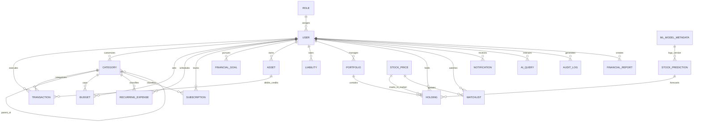

# SMARTFIN AI — Production Database Architecture & Data Dictionary

**Enterprise Personal Finance, Investment & Stock Market Intelligence Platform**  
*Document Version: 2.0.0 | Status: Production Specification Approved*

---

## 1. Data Tier Architecture Overview

SMARTFIN AI employs **MongoDB 7.0+** managed via **Mongoose ODM** with strict TypeScript typing, declarative schema validations, compound indexing, and automated audit trails.

### Core Architectural Principles:
1. **User Ownership & Tenant Scoping**: All user-facing documents include an indexed `userId` foreign key referencing the `User` collection. Queries in domain services must always scope by `userId` to eliminate Insecure Direct Object References (IDOR).
2. **Soft Deletion Pattern**: Critical financial entities (`Transaction`, `Category`, `Budget`, `RecurringExpense`, `Subscription`, `FinancialGoal`, `Asset`, `Liability`, `Portfolio`, `Holding`, `Watchlist`, `FinancialReport`) implement soft deletion via `isDeleted: boolean` (indexed) and `deletedAt?: Date`. Hard deletes are prohibited in the core ledger.
3. **Optimistic Concurrency & Timestamps**: Every collection enforces automatic Mongoose `timestamps: true` (`createdAt` and `updatedAt`). Financial ledgers support ACID multi-document transactions (`session.withTransaction()`).
4. **Normalized Currency & Amounts**: All currency amounts are positive decimal numbers, with the direction of money movement determined by transaction type (`INCOME`, `EXPENSE`, `TRANSFER`). Currencies use ISO 4217 standard 3-character uppercase codes.

---

## 2. Complete Entity Relationship Diagram (ERD)



---

## 3. Data Dictionary: 20 Production Mongoose Models

### 3.1 Role Model (`roles` collection)
Defines Role-Based Access Control (RBAC) tiers and granular permission slugs.
- **Model Name**: `Role`
- **File**: `backend/src/models/role.model.ts`
- **Enums**: `RoleName` (`USER`, `PREMIUM_USER`, `FINANCIAL_ANALYST`, `COMPLIANCE_OFFICER`, `SUPER_ADMIN`)
- **Fields**:
  | Field | Type | Required | Constraints / Default | Description |
  | :--- | :--- | :---: | :--- | :--- |
  | `name` | String | Yes | Unique, Enum, Indexed | Primary role identifier |
  | `description`| String | Yes | Trimmed | Human-readable role explanation |
  | `permissions`| [String]| No | Default: `[]` | Permission slugs (e.g. `finance:all`) |
  | `isSystem` | Boolean | No | Default: `true`, Indexed | Guard against deleting built-in roles |
  | `createdAt` | Date | Auto | Mongoose Timestamp | Record creation timestamp |
  | `updatedAt` | Date | Auto | Mongoose Timestamp | Record update timestamp |

---

### 3.2 User Model (`users` collection)
Primary identity and authentication entity.
- **Model Name**: `User`
- **File**: `backend/src/models/user.model.ts`
- **Fields**:
  | Field | Type | Required | Constraints / Default | Description |
  | :--- | :--- | :---: | :--- | :--- |
  | `email` | String | Yes | Unique, Lowercase, Trim, Indexed | User email address (primary login) |
  | `passwordHash` | String | Yes | `select: false` | Bcrypt / Argon2id hashed password |
  | `firstName` | String | Yes | Maxlength 50 | User first name |
  | `lastName` | String | Yes | Maxlength 50 | User last name |
  | `role` | String | Yes | Enum `RoleName`, Default `USER` | Denormalized fast role check |
  | `roleId` | ObjectId | No | Ref `Role`, Indexed | Reference to Role document |
  | `isEmailVerified`| Boolean | No | Default: `false` | Email verification flag |
  | `isMfaEnabled` | Boolean | No | Default: `false` | Two-factor authentication status |
  | `mfaSecret` | String | No | `select: false` | Encrypted TOTP secret key |
  | `defaultCurrency`| String | No | Default: `'USD'`, 3-char ISO | Default display currency |
  | `locale` | String | No | Default: `'en-US'` | User localization preference |
  | `preferences` | Object | No | `{ theme, emailAlerts, pushAlerts }` | UI and notification settings |
  | `failedLoginAttempts` | Number | No | Default: `0` | Brute force defense counter |
  | `lockoutUntil` | Date | No | Nullable | Account temporary lockout deadline |
  | `lastLoginAt` | Date | No | Nullable | Timestamp of latest login session |
  | `isDeleted` | Boolean | No | Default: `false`, Indexed | Soft-deletion flag |
  | `deletedAt` | Date | No | Nullable | Timestamp of account deactivation |

---

### 3.3 Transaction Model (`transactions` collection)
Central financial ledger record representing income, expenditures, and transfers.
- **Model Name**: `Transaction`
- **File**: `backend/src/models/transaction.model.ts`
- **Enums**:
  - `TransactionType`: `INCOME`, `EXPENSE`, `TRANSFER`
  - `PaymentMethod`: `CASH`, `CREDIT_CARD`, `DEBIT_CARD`, `BANK_TRANSFER`, `CRYPTO`, `OTHER`
  - `TransactionSource`: `MANUAL`, `CSV_IMPORT`, `PLAID_SYNC`, `API`
- **Fields**:
  | Field | Type | Required | Constraints / Default | Description |
  | :--- | :--- | :---: | :--- | :--- |
  | `userId` | ObjectId | Yes | Ref `User`, Indexed | Owner of the transaction |
  | `type` | String | Yes | Enum `TransactionType`, Indexed | Direction of cash movement |
  | `amount` | Number | Yes | Min: `0.01` | Absolute transaction amount |
  | `currency` | String | Yes | Default: `'USD'`, 3-char ISO | Currency denomination |
  | `merchant` | String | Yes | Trim, Indexed | Merchant or counterparty name |
  | `description` | String | No | Default: `''` | User or statement transaction memo |
  | `category` | ObjectId | Yes | Ref `Category`, Indexed | Associated category |
  | `subcategory`| String | No | Trim | Subcategory label or tag |
  | `date` | Date | Yes | Indexed | Transaction execution date |
  | `paymentMethod`| String | Yes | Enum `PaymentMethod` | Payment mechanism used |
  | `isRecurring` | Boolean | No | Default: `false`, Indexed | Recurring transaction flag |
  | `recurringExpenseId` | ObjectId | No | Ref `RecurringExpense`, Indexed | Linked recurring schedule |
  | `subscriptionId` | ObjectId | No | Ref `Subscription`, Indexed | Linked active subscription |
  | `source` | String | Yes | Enum `TransactionSource` | Origin of data ingestion |
  | `assetId` | ObjectId | No | Ref `Asset`, Indexed | Associated payment account |
  | `destinationAssetId` | ObjectId | No | Ref `Asset` | Destination account (for transfers) |
  | `deduplicationHash` | String | No | Sparse, Indexed | Hash preventing duplicate imports |
  | `metadata` | Mixed | No | Key-value object | Tax, tip, geolocation, or raw memo |
  | `tags` | [String] | No | Default: `[]` | User custom tags |
  | `isDeleted` | Boolean | No | Default: `false`, Indexed | Soft delete flag |
  | `deletedAt` | Date | No | Nullable | Deletion timestamp |
- **Compound Indexes**:
  - `{ userId: 1, date: -1 }` (Primary retrieval timeline)
  - `{ userId: 1, category: 1, date: -1 }` (Category spending breakdown)
  - `{ userId: 1, type: 1, date: -1 }` (Income vs. expense trend queries)

---

### 3.4 Category Model (`categories` collection)
Hierarchical taxonomy for organizing transactions and budgets.
- **Model Name**: `Category`
- **File**: `backend/src/models/category.model.ts`
- **Enums**: `CategoryType` (`INCOME`, `EXPENSE`, `TRANSFER`)
- **Fields**:
  | Field | Type | Required | Constraints / Default | Description |
  | :--- | :--- | :---: | :--- | :--- |
  | `userId` | ObjectId | No | Ref `User`, Nullable, Indexed | Null for system categories |
  | `name` | String | Yes | Trim, Maxlength 60 | Display name |
  | `slug` | String | Yes | Lowercase, Trim, Indexed | URL-friendly unique slug |
  | `type` | String | Yes | Enum `CategoryType`, Indexed | Category ledger classification |
  | `parentId` | ObjectId | No | Ref `Category`, Nullable, Indexed | Parent category for hierarchy |
  | `icon` | String | No | Default: `'tag'` | Lucide icon identifier |
  | `color` | String | No | Hex color code | UI visual tag color |
  | `isSystem` | Boolean | No | Default: `false`, Indexed | Protected system preset flag |
  | `isDeleted` | Boolean | No | Default: `false` | Soft delete flag |
  | `deletedAt` | Date | No | Nullable | Deletion timestamp |
- **Compound Unique Index**: `{ userId: 1, slug: 1 }` (Unique per user / system)

---

### 3.5 Budget Model (`budgets` collection)
Spending caps and rollover tracking by category and period.
- **Model Name**: `Budget`
- **File**: `backend/src/models/budget.model.ts`
- **Enums**: `BudgetPeriod` (`WEEKLY`, `MONTHLY`, `ANNUAL`, `CUSTOM`)
- **Fields**:
  | Field | Type | Required | Constraints / Default | Description |
  | :--- | :--- | :---: | :--- | :--- |
  | `userId` | ObjectId | Yes | Ref `User`, Indexed | Owner |
  | `categoryId` | ObjectId | Yes | Ref `Category`, Indexed | Category being capped |
  | `name` | String | Yes | Maxlength 100 | Budget title |
  | `amount` | Number | Yes | Min: `0.01` | Maximum allocated spending limit |
  | `spent` | Number | No | Default: `0`, Min: `0` | Current expenditure in period |
  | `period` | String | Yes | Enum `BudgetPeriod`, Indexed | Recurrence cadence |
  | `startDate` | Date | Yes | Indexed | Period beginning date |
  | `endDate` | Date | Yes | — | Period termination date |
  | `currency` | String | No | Default: `'USD'`, 3-char ISO | Denomination currency |
  | `notifyAt80` | Boolean | No | Default: `true` | Send alert at 80% utilization |
  | `notifyAt100` | Boolean | No | Default: `true` | Send alert at 100% threshold |
  | `alertSent80` | Boolean | No | Default: `false` | Idempotency guard for 80% alert |
  | `alertSent100` | Boolean | No | Default: `false` | Idempotency guard for 100% alert |
  | `rolloverRemaining` | Boolean| No | Default: `false` | Carry surplus into next cycle |
  | `isDeleted` | Boolean | No | Default: `false`, Indexed | Soft delete flag |
- **Compound Index**: `{ userId: 1, categoryId: 1, startDate: 1 }`

---

### 3.6 RecurringExpense Model (`recurringexpenses` collection)
Scheduled bills, rent, utilities, and debt payments.
- **Model Name**: `RecurringExpense`
- **File**: `backend/src/models/recurring-expense.model.ts`
- **Enums**: `RecurringFrequency` (`DAILY`, `WEEKLY`, `BIWEEKLY`, `MONTHLY`, `QUARTERLY`, `ANNUALLY`)
- **Fields**:
  | Field | Type | Required | Constraints / Default | Description |
  | :--- | :--- | :---: | :--- | :--- |
  | `userId` | ObjectId | Yes | Ref `User`, Indexed | Owner |
  | `categoryId` | ObjectId | No | Ref `Category`, Indexed | Associated category |
  | `merchant` | String | Yes | Trim, Indexed | Payee |
  | `description` | String | No | Default: `''` | Memo |
  | `expectedAmount` | Number | Yes | Min: `0.01` | Estimated expense amount |
  | `currency` | String | No | Default: `'USD'`, 3-char ISO | Currency code |
  | `frequency` | String | Yes | Enum `RecurringFrequency`, Indexed | Cadence of bill |
  | `startDate` | Date | Yes | — | First occurrence date |
  | `nextDueDate` | Date | Yes | Indexed | Next projected payment date |
  | `lastProcessedDate` | Date | No | Nullable | Previous deduction date |
  | `isActive` | Boolean | No | Default: `true`, Indexed | Active billing status |
  | `autoDetected`| Boolean | No | Default: `false` | Flagged by ML subscription detector |
  | `isDeleted` | Boolean | No | Default: `false` | Soft delete flag |
- **Compound Index**: `{ userId: 1, isActive: 1, nextDueDate: 1 }` (Background worker scheduling)

---

### 3.7 Subscription Model (`subscriptions` collection)
Active digital and recurring service subscriptions with price change history.
- **Model Name**: `Subscription`
- **File**: `backend/src/models/subscription.model.ts`
- **Enums**:
  - `SubscriptionBillingCycle`: `MONTHLY`, `QUARTERLY`, `ANNUALLY`
  - `SubscriptionStatus`: `ACTIVE`, `PAUSED`, `CANCELLED`
- **Fields**:
  | Field | Type | Required | Constraints / Default | Description |
  | :--- | :--- | :---: | :--- | :--- |
  | `userId` | ObjectId | Yes | Ref `User`, Indexed | Owner |
  | `name` | String | Yes | Trim, Maxlength 100 | Service name (e.g. Netflix) |
  | `merchant` | String | Yes | Trim, Indexed | Billing entity |
  | `categoryId` | ObjectId | No | Ref `Category`, Indexed | Expense category |
  | `planTier` | String | No | Trim | Subscription tier name |
  | `billingCycle` | String | Yes | Enum `SubscriptionBillingCycle` | Billing frequency |
  | `amount` | Number | Yes | Min: `0.01` | Current recurring cost |
  | `currency` | String | No | Default: `'USD'`, 3-char ISO | Currency |
  | `status` | String | Yes | Enum `SubscriptionStatus`, Indexed | Subscription status |
  | `renewalDate` | Date | Yes | Indexed | Next auto-renew date |
  | `cancellationUrl` | String | No | Trim | Direct link to cancellation portal |
  | `priceHistory` | Array | No | `[{ amount, effectiveDate }]` | Historical rate adjustments |
  | `priceChangeAlert` | Boolean | No | Default: `true` | Notify if charge changes |
  | `isDeleted` | Boolean | No | Default: `false` | Soft delete flag |
- **Compound Index**: `{ userId: 1, status: 1, renewalDate: 1 }`

---

### 3.8 FinancialGoal Model (`financialgoals` collection)
Milestone-driven savings, debt payoff, or investment goals.
- **Model Name**: `FinancialGoal`
- **File**: `backend/src/models/financial-goal.model.ts`
- **Enums**:
  - `GoalCategory`: `EMERGENCY_FUND`, `RETIREMENT`, `HOME_PURCHASE`, `TRAVEL`, `DEBT_PAYOFF`, `INVESTMENT`, `OTHER`
  - `GoalStatus`: `IN_PROGRESS`, `ACHIEVED`, `ABANDONED`
- **Fields**:
  | Field | Type | Required | Constraints / Default | Description |
  | :--- | :--- | :---: | :--- | :--- |
  | `userId` | ObjectId | Yes | Ref `User`, Indexed | Owner |
  | `title` | String | Yes | Trim, Maxlength 120 | Goal title |
  | `description` | String | No | Default: `''` | Long-form notes |
  | `targetAmount` | Number | Yes | Min: `1` | Target total funds needed |
  | `currentAmount` | Number | No | Default: `0`, Min: `0` | Total funds accrued |
  | `currency` | String | No | Default: `'USD'` | Currency denomination |
  | `targetDate` | Date | Yes | Indexed | Target completion date |
  | `category` | String | Yes | Enum `GoalCategory`, Indexed | Goal classification |
  | `status` | String | Yes | Enum `GoalStatus`, Indexed | Current state of progress |
  | `autoContributeMonthly` | Number | No | Default: `0` | Monthly contribution plan |
  | `linkedAssetId` | ObjectId | No | Ref `Asset` | Dedicated bank/investment asset |
  | `isDeleted` | Boolean | No | Default: `false` | Soft delete flag |
- **Compound Index**: `{ userId: 1, status: 1, targetDate: 1 }`

---

### 3.9 Asset Model (`assets` collection)
Positive net-worth holdings (bank accounts, real estate, cash, crypto).
- **Model Name**: `Asset`
- **File**: `backend/src/models/asset.model.ts`
- **Enums**: `AssetType` (`CASH`, `BANK_ACCOUNT`, `INVESTMENT`, `REAL_ESTATE`, `CRYPTO`, `VEHICLE`, `PRECIOUS_METALS`, `OTHER`)
- **Fields**:
  | Field | Type | Required | Constraints / Default | Description |
  | :--- | :--- | :---: | :--- | :--- |
  | `userId` | ObjectId | Yes | Ref `User`, Indexed | Owner |
  | `name` | String | Yes | Trim, Maxlength 100 | Asset name |
  | `type` | String | Yes | Enum `AssetType`, Indexed | Asset classification |
  | `institutionName` | String | No | Trim | Holding bank or institution |
  | `accountNumberMasked` | String | No | Trim | Masked number (`****-1234`) |
  | `currentValue` | Number | Yes | Min: `0` | Current assessed value |
  | `currency` | String | No | Default: `'USD'` | Currency denomination |
  | `appreciationRateAnnual` | Number | No | Default: `0` | Projected annual growth % |
  | `isLiquid` | Boolean | No | Default: `true`, Indexed | Immediate liquidity flag |
  | `notes` | String | No | Default: `''` | Valuation notes |
  | `isDeleted` | Boolean | No | Default: `false` | Soft delete flag |
- **Compound Index**: `{ userId: 1, type: 1, isDeleted: 1 }`

---

### 3.10 Liability Model (`liabilities` collection)
Debts, loans, and financial obligations reducing net worth.
- **Model Name**: `Liability`
- **File**: `backend/src/models/liability.model.ts`
- **Enums**: `LiabilityType` (`MORTGAGE`, `CREDIT_CARD`, `STUDENT_LOAN`, `AUTO_LOAN`, `PERSONAL_LOAN`, `OTHER`)
- **Fields**:
  | Field | Type | Required | Constraints / Default | Description |
  | :--- | :--- | :---: | :--- | :--- |
  | `userId` | ObjectId | Yes | Ref `User`, Indexed | Owner |
  | `name` | String | Yes | Trim, Maxlength 100 | Obligation name |
  | `type` | String | Yes | Enum `LiabilityType`, Indexed | Debt classification |
  | `lender` | String | No | Trim | Financial creditor |
  | `principalAmount` | Number | No | Default: `0` | Original debt balance |
  | `currentBalance` | Number | Yes | Min: `0` | Outstanding liability amount |
  | `currency` | String | No | Default: `'USD'` | Currency code |
  | `interestRateApr` | Number | No | Default: `0` | Annual percentage rate (APR) |
  | `minimumPaymentMonthly`| Number | No | Default: `0` | Monthly debt servicing requirement |
  | `dueDayOfMonth` | Number | No | Min: 1, Max: 31 | Due day of billing cycle |
  | `notes` | String | No | Default: `''` | Payment terms |
  | `isDeleted` | Boolean | No | Default: `false` | Soft delete flag |
- **Compound Index**: `{ userId: 1, type: 1, isDeleted: 1 }`

---

### 3.11 Portfolio Model (`portfolios` collection)
Investment portfolio aggregating stock, ETF, and crypto holdings.
- **Model Name**: `Portfolio`
- **File**: `backend/src/models/portfolio.model.ts`
- **Fields**:
  | Field | Type | Required | Constraints / Default | Description |
  | :--- | :--- | :---: | :--- | :--- |
  | `userId` | ObjectId | Yes | Ref `User`, Indexed | Owner |
  | `name` | String | Yes | Trim, Maxlength 100 | Portfolio title |
  | `description` | String | No | Default: `''` | Strategy or thesis memo |
  | `baseCurrency`| String | No | Default: `'USD'` | Currency denomination |
  | `cashBalance` | Number | No | Default: `0` | Uninvested liquid cash |
  | `isDefault` | Boolean | No | Default: `false` | Primary default portfolio |
  | `benchmarkSymbol` | String | No | Default: `'SPY'` | Comparative benchmark ticker |
  | `isDeleted` | Boolean | No | Default: `false` | Soft delete flag |
- **Index**: `{ userId: 1, isDeleted: 1 }`

---

### 3.12 Holding Model (`holdings` collection)
Discrete asset positions held within a portfolio with tax lots and P&L tracking.
- **Model Name**: `Holding`
- **File**: `backend/src/models/holding.model.ts`
- **Enums**: `HoldingAssetType` (`EQUITY`, `ETF`, `MUTUAL_FUND`, `CRYPTO`, `BOND`, `OTHER`)
- **Fields**:
  | Field | Type | Required | Constraints / Default | Description |
  | :--- | :--- | :---: | :--- | :--- |
  | `portfolioId` | ObjectId | Yes | Ref `Portfolio`, Indexed | Associated portfolio |
  | `userId` | ObjectId | Yes | Ref `User`, Indexed | Owner |
  | `symbol` | String | Yes | Uppercase, Trim, Indexed | Market ticker symbol |
  | `assetType` | String | Yes | Enum `HoldingAssetType`, Indexed | Instrument class |
  | `quantity` | Number | Yes | Min: `0` | Total units held |
  | `averageBuyPrice` | Number | Yes | Min: `0` | Weighted average cost per unit |
  | `currentPrice` | Number | No | Default: `0` | Marked-to-market latest price |
  | `currentValue` | Number | Auto | Calculated on pre-save | `quantity * currentPrice` |
  | `totalCost` | Number | Auto | Calculated on pre-save | `quantity * averageBuyPrice` |
  | `unrealizedPnL` | Number | Auto | Calculated on pre-save | `currentValue - totalCost` |
  | `unrealizedPnLPercent`| Number | Auto | Calculated on pre-save | Return percentage |
  | `realizedPnL` | Number | No | Default: `0` | Historical realized profit/loss |
  | `lots` | Array | No | Subdocument array | Purchase tax lots (`quantity`, `price`, `fees`) |
  | `currency` | String | No | Default: `'USD'` | Denomination currency |
  | `lastPriceUpdatedAt` | Date | No | Default: `Date.now` | Market quote refresh timestamp |
  | `isDeleted` | Boolean | No | Default: `false` | Soft delete flag |
- **Compound Index**: `{ portfolioId: 1, symbol: 1, isDeleted: 1 }`

---

### 3.13 Watchlist Model (`watchlists` collection)
Curated lists of financial tickers with target alert triggers.
- **Model Name**: `Watchlist`
- **File**: `backend/src/models/watchlist.model.ts`
- **Fields**:
  | Field | Type | Required | Constraints / Default | Description |
  | :--- | :--- | :---: | :--- | :--- |
  | `userId` | ObjectId | Yes | Ref `User`, Indexed | Owner |
  | `name` | String | Yes | Trim, Maxlength 100 | Watchlist name |
  | `description` | String | No | Default: `''` | Thesis description |
  | `isDefault` | Boolean | No | Default: `false` | Default user watchlist |
  | `symbols` | Array | No | Subdocuments | `[{ symbol, addedAt, targetBuyPrice, targetSellPrice }]` |
  | `isDeleted` | Boolean | No | Default: `false` | Soft delete flag |
- **Compound Index**: `{ userId: 1, isDeleted: 1 }`, `{ 'symbols.symbol': 1 }`

---

### 3.14 StockPrice Model (`stockprices` collection)
High-throughput historical and intraday OHLCV candlestick storage.
- **Model Name**: `StockPrice`
- **File**: `backend/src/models/stock-price.model.ts`
- **Enums**: `PriceTimeframe` (`INTRADAY_1M`, `INTRADAY_5M`, `INTRADAY_15M`, `DAILY`, `WEEKLY`)
- **Fields**:
  | Field | Type | Required | Constraints / Default | Description |
  | :--- | :--- | :---: | :--- | :--- |
  | `symbol` | String | Yes | Uppercase, Trim, Indexed | Market symbol |
  | `timestamp` | Date | Yes | Indexed | Candlestick time |
  | `timeframe` | String | Yes | Enum `PriceTimeframe`, Indexed | Sampling interval |
  | `open` | Number | Yes | — | Period opening price |
  | `high` | Number | Yes | — | Period maximum price |
  | `low` | Number | Yes | — | Period minimum price |
  | `close` | Number | Yes | — | Period closing price |
  | `volume` | Number | Yes | Default: `0` | Traded volume |
  | `adjustedClose` | Number | No | — | Split/dividend adjusted close |
  | `change` | Number | No | — | Net price difference |
  | `changePercent` | Number | No | — | Percentage price change |
  | `source` | String | No | Default: `'FINNHUB'` | Upstream data provider |
- **Compound Unique Index**: `{ symbol: 1, timeframe: 1, timestamp: -1 }`

---

### 3.15 StockPrediction Model (`stockpredictions` collection)
Machine learning quantitative forecasts, directional probabilities, and backtesting audits.
- **Model Name**: `StockPrediction`
- **File**: `backend/src/models/stock-prediction.model.ts`
- **Enums**:
  - `PredictionHorizon`: `1D`, `5D`, `10D`, `30D`, `90D`
  - `PredictionStatus`: `PENDING_EVALUATION`, `EVALUATED`, `EXPIRED`
- **Fields**:
  | Field | Type | Required | Constraints / Default | Description |
  | :--- | :--- | :---: | :--- | :--- |
  | `symbol` | String | Yes | Uppercase, Trim, Indexed | Ticker forecasted |
  | `model` | String | Yes | Trim, Indexed | Model name (e.g. `XGBOOST_DIRECTIONAL`) |
  | `predictionHorizon` | String | Yes | Enum `PredictionHorizon` | Lookahead duration |
  | `predictionTimestamp` | Date | Yes | Default: `Date.now`, Indexed | Generation timestamp |
  | `predictedValue` | Number | Yes | — | Absolute price forecast |
  | `predictedReturn` | Number | Yes | — | Expected return (+5.2% = 0.052) |
  | `modelVersion` | String | Yes | Trim | Model semantic version |
  | `evaluationMetrics` | Object | No | `{ mape, mae, rmse, confidenceScore }` | Model quality metrics |
  | `featureVersion` | String | Yes | Trim | Feature engineering schema version |
  | `dataTimestamp` | Date | Yes | — | Market data cutoff timestamp |
  | `actualValue` | Number | No | Post-horizon filled | Realized market price |
  | `actualReturn` | Number | No | Post-horizon filled | Realized percentage return |
  | `status` | String | Yes | Enum `PredictionStatus`, Indexed | Backtest evaluation state |
  | `isDeleted` | Boolean | No | Default: `false` | Soft delete flag |
- **Compound Indexes**:
  - `{ symbol: 1, predictionTimestamp: -1 }`
  - `{ model: 1, modelVersion: 1 }`
  - `{ status: 1, predictionTimestamp: 1 }`

---

### 3.16 Notification Model (`notifications` collection)
In-app and push notification alerts.
- **Model Name**: `Notification`
- **File**: `backend/src/models/notification.model.ts`
- **Enums**:
  - `NotificationType`: `BUDGET_EXCEEDED`, `STOCK_ALERT`, `ANOMALY_DETECTED`, `BILL_DUE`, `GOAL_MILESTONE`, `SYSTEM`
  - `NotificationPriority`: `LOW`, `MEDIUM`, `HIGH`, `CRITICAL`
- **Fields**:
  | Field | Type | Required | Constraints / Default | Description |
  | :--- | :--- | :---: | :--- | :--- |
  | `userId` | ObjectId | Yes | Ref `User`, Indexed | Recipient |
  | `title` | String | Yes | Trim, Maxlength 150 | Notification headline |
  | `message` | String | Yes | Trim | Detail text |
  | `type` | String | Yes | Enum `NotificationType`, Indexed | Category of alert |
  | `priority` | String | Yes | Enum `NotificationPriority` | Severity indicator |
  | `isRead` | Boolean | No | Default: `false`, Indexed | Read status |
  | `readAt` | Date | No | Nullable | Reading timestamp |
  | `actionUrl` | String | No | Trim | In-app navigation route |
  | `metadata` | Mixed | No | Key-value | Transaction/Stock payload details |
  | `isDeleted` | Boolean | No | Default: `false` | Soft delete flag |
- **Compound Index**: `{ userId: 1, isRead: 1, createdAt: -1 }`

---

### 3.17 AIQuery Model (`aiqueries` collection)
Financial RAG and AI Assistant (FinBot) session logs and semantic intent capture.
- **Model Name**: `AIQuery`
- **File**: `backend/src/models/ai-query.model.ts`
- **Enums**:
  - `AIQueryIntent`: `BUDGET_INQUIRY`, `EXPENSE_ANALYSIS`, `PORTFOLIO_REVIEW`, `MARKET_LOOKUP`, `GENERAL_FINANCE`
  - `AIQueryFeedback`: `UNRATED`, `HELPFUL`, `UNHELPFUL`, `INACCURATE`
- **Fields**:
  | Field | Type | Required | Constraints / Default | Description |
  | :--- | :--- | :---: | :--- | :--- |
  | `userId` | ObjectId | Yes | Ref `User`, Indexed | Prompt originator |
  | `sessionId` | String | Yes | Indexed | Conversational session UUID |
  | `prompt` | String | Yes | Trim | User natural language prompt |
  | `intent` | String | Yes | Enum `AIQueryIntent`, Indexed | Detected semantic intent |
  | `entities` | Mixed | No | Structured entities | Extracted dates, categories, symbols |
  | `contextSnapshot` | Mixed | No | Sanitized user context | Anonymized data passed to LLM |
  | `response` | String | Yes | Markdown text | FinBot response |
  | `tokensUsed` | Number | No | Default: `0` | LLM token consumption |
  | `latencyMs` | Number | No | Default: `0` | Response generation time |
  | `feedback` | String | No | Enum `AIQueryFeedback` | User rating |
  | `feedbackNotes` | String | No | Default: `''` | User comment |
- **Compound Index**: `{ userId: 1, sessionId: 1, createdAt: -1 }`

---

### 3.18 AuditLog Model (`auditlogs` collection)
Immutable, append-only security and compliance audit trail.
- **Model Name**: `AuditLog`
- **File**: `backend/src/models/audit-log.model.ts`
- **Enums**: `AuditStatus` (`SUCCESS`, `FAILURE`)
- **Fields**:
  | Field | Type | Required | Constraints / Default | Description |
  | :--- | :--- | :---: | :--- | :--- |
  | `userId` | ObjectId | No | Ref `User`, Indexed | Actor (or null for system/anon) |
  | `actorRole` | String | Yes | Default: `'ANONYMOUS'` | Role at time of action |
  | `action` | String | Yes | Trim, Indexed | Operation (e.g. `USER_LOGIN`) |
  | `resource` | String | Yes | Trim, Indexed | Target entity (e.g. `TRANSACTION`) |
  | `resourceId` | String | No | Indexed | Identifier of target resource |
  | `ipAddress` | String | No | Default: `'127.0.0.1'` | Client IPv4/IPv6 |
  | `userAgent` | String | No | Default: `'Unknown'` | Browser or API client |
  | `changes` | Object | No | `{ before, after }` | Diff of modified attributes |
  | `status` | String | Yes | Enum `AuditStatus`, Indexed | Execution outcome |
  | `failureReason`| String | No | Nullable | Exception or denial explanation |
  | `timestamp` | Date | Yes | Default: `Date.now`, Indexed | Tamper-evident timestamp |
- **Compound Indexes**:
  - `{ userId: 1, timestamp: -1 }`
  - `{ action: 1, timestamp: -1 }`

---

### 3.19 MLModelMetadata Model (`mlmodelmetadatas` collection)
MLOps model registry storing versioned artifacts, hyperparameters, and evaluation benchmarks.
- **Model Name**: `MLModelMetadata`
- **File**: `backend/src/models/ml-model-metadata.model.ts`
- **Enums**: `MLFramework` (`SCIKIT_LEARN`, `XGBOOST`, `PYTORCH`, `PROPHET`, `STATSMODELS`)
- **Fields**:
  | Field | Type | Required | Constraints / Default | Description |
  | :--- | :--- | :---: | :--- | :--- |
  | `modelName` | String | Yes | Trim, Indexed | Canonical model name |
  | `version` | String | Yes | Trim | Semantic version tag |
  | `framework` | String | Yes | Enum `MLFramework`, Indexed | Machine learning library used |
  | `artifactUri` | String | Yes | — | S3 or local path to `.joblib`/`.pt` |
  | `artifactChecksum` | String | Yes | — | SHA-256 integrity hash |
  | `features` | [String] | No | Default: `[]` | Feature input columns |
  | `hyperparameters`| Mixed | No | Key-value | Model configuration parameters |
  | `metrics` | Mixed | No | Key-value | Evaluation scores (F1, MAE, RMSE) |
  | `trainingDatasetSize`| Number | No | Default: `0` | Row count in training split |
  | `trainedAt` | Date | No | Default: `Date.now` | Training completion timestamp |
  | `isActive` | Boolean | No | Default: `false`, Indexed | Currently serving model flag |
  | `description` | String | No | Default: `''` | Release notes |
- **Compound Unique Index**: `{ modelName: 1, version: 1 }`

---

### 3.20 FinancialReport Model (`financialreports` collection)
Generated statements, annual tax reports, and net worth summaries.
- **Model Name**: `FinancialReport`
- **File**: `backend/src/models/financial-report.model.ts`
- **Enums**:
  - `ReportType`: `NET_WORTH_STATEMENT`, `TAX_SUMMARY`, `CASH_FLOW_ANALYSIS`, `PORTFOLIO_PERFORMANCE`, `EXPENSE_BREAKDOWN`
  - `ReportPeriod`: `MONTHLY`, `QUARTERLY`, `ANNUAL`, `CUSTOM`
- **Fields**:
  | Field | Type | Required | Constraints / Default | Description |
  | :--- | :--- | :---: | :--- | :--- |
  | `userId` | ObjectId | Yes | Ref `User`, Indexed | Owner |
  | `title` | String | Yes | Trim, Maxlength 120 | Report title |
  | `type` | String | Yes | Enum `ReportType`, Indexed | Report classification |
  | `period` | String | Yes | Enum `ReportPeriod`, Indexed | Time aggregation scope |
  | `startDate` | Date | Yes | — | Window start date |
  | `endDate` | Date | Yes | — | Window end date |
  | `currency` | String | No | Default: `'USD'` | Reporting currency |
  | `data` | Mixed | No | Key-value | Materialized summary tables & charts |
  | `fileUrl` | String | No | Trim | Download URL for PDF/CSV |
  | `generatedAt` | Date | No | Default: `Date.now` | Materialization timestamp |
  | `isDeleted` | Boolean | No | Default: `false` | Soft delete flag |
- **Compound Index**: `{ userId: 1, type: 1, generatedAt: -1 }`

---

## 4. Development Seed Scripts & Safe Provisioning

The database seed script (`backend/src/seeds/seed.ts`) can be executed via:
```bash
npm --workspace=backend run seed
```

### Safety Rules Enforced:
1. **Idempotent Insertion**: Checks existence prior to creating roles and categories.
2. **Production Safeguards**: Development admin user (`admin@smartfin.ai`) is **strictly bypassed** when `NODE_ENV === 'production'`.
3. **Pre-Hashed Credentials**: Passwords pass through Mongoose `pre('save')` hooks utilizing 10 rounds of salt before persisting to MongoDB.
