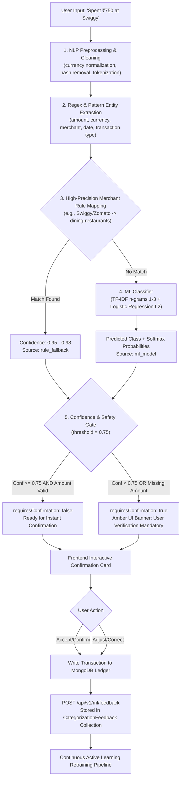
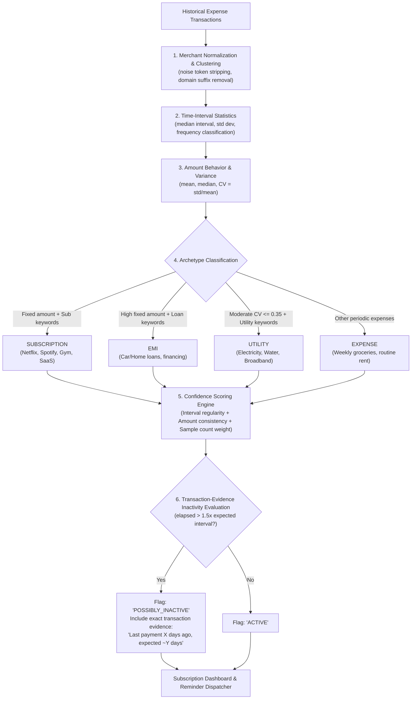

# SMARTFIN AI — Machine Learning & Quantitative Intelligence Architecture

**Enterprise Personal Finance & Investment Intelligence Platform**  
*Document Version: 1.0.0 | Status: Approved ML Architecture*

---

## 1. Machine Learning System Philosophy

The intelligence engine of **SMARTFIN AI** is designed around three non-negotiable principles:
1. **Microservice Isolation**: Heavy mathematical computation, vector operations, and neural network inferences reside in a dedicated **Python 3.11 / FastAPI** service (`smartfin-ml-service`). The Node.js application gateway remains responsive and does not suffer CPU-bound event-loop starvation.
2. **Defensive Modeling & Explainability**: Financial machine learning models must not be black boxes. Every anomaly flag, expense forecast, and stock trend prediction outputs confidence intervals, feature importances, and clear regulatory disclaimers.
3. **Data Privacy & Partitioning**: ML inference and context building strictly isolate user data. No user's financial figures are used in global training without anonymization, and RAG contexts are restricted to the authenticated tenant.

---

## 2. ML Microservice Architecture Diagram

```mermaid
flowchart TB
    subgraph Gateway ["Node.js API / BullMQ Workers"]
        NodeAPI["Node.js Express API"]
        WorkerQueue["BullMQ Background Workers"]
    end

    subgraph MLService ["Python 3.11 FastAPI Microservice (Port 8000)"]
        FastAPIInbound["FastAPI Ingress & Request Validation (Pydantic)"]
        TokenAuth["Internal HMAC / Service Token Authenticator"]
        
        subgraph PipelineLayer ["Analytical & ML Pipelines"]
            Categorizer["1. Categorization Engine (TF-IDF + XGBoost / Rules)"]
            AnomalyDetector["2. Anomaly Detection (Isolation Forest + Z-Score)"]
            ExpenseForecaster["3. Expense Forecaster (Prophet / Holt-Winters)"]
            CashFlowSim["4. Cash-Flow & Runway Simulator (Monte Carlo)"]
            SubscriptionDetector["5. Subscription Engine (FFT / Interval Variance)"]
            StockModel["6. Stock Trend & Volatility Model (XGBoost / LSTM)"]
            FinBotEngine["7. FinBot Financial RAG & Intent Classifier"]
        end

        subgraph ModelStore ["Model Artifact Storage"]
            LocalWeights["Local Serialized Artifacts (.joblib / .pt)"]
            S3ModelRegistry["S3 Model Registry & Version Tracking"]
        end
    end

    NodeAPI -->|REST (JSON)| FastAPIInbound
    WorkerQueue -->|Batch REST| FastAPIInbound
    FastAPIInbound --> TokenAuth
    TokenAuth --> PipelineLayer

    PipelineLayer --> ModelStore
```

---

## 3. Core ML Pipelines & Quantitative Algorithms

### 3.1 Pipeline 1: Intelligent Transaction Auto-Categorization & Entity Parsing

#### Business & Operational Goal
Extract structured financial entities (`amount`, `merchant`, `category`, `subcategory`, `transactionType`, `date`, `confidence`) from unstructured natural language inputs (e.g. `"Spent ₹750 at Swiggy"` or `"I spent 800 on dinner at Zomato yesterday"`), classify them into standardized hierarchical categories, and protect the financial ledger against silent misclassifications using strict confidence thresholds.

#### Architecture & Multi-Tier Resolution Flow


#### Detailed ML Components
1. **Dataset Preparation (`dataset.py`)**:
   - Curated multi-class labeled financial corpus with hundreds of real-world Indian and international expense and income descriptions.
   - Covers 12 primary categories: `dining-restaurants`, `groceries`, `transportation-transit`, `utilities-bills`, `entertainment-subscriptions`, `shopping-retail`, `health-fitness`, `travel-lodging`, `education-learning`, `personal-care`, `salary-income`, `investments-dividends`.
2. **Text Cleaning & Normalization (`preprocessor.py`)**:
   - Currency symbol normalization (`₹`, `rs`, `inr`, `$`, `usd`, `eur`, `gbp`).
   - Transaction reference noise removal (UTR codes, POS terminal prefixes like `UPI/`, `POS *`, `NEFT-`).
   - Punctuation stripping, whitespace normalization, and domain stopword tuning.
3. **Structured Entity Extractor (`extractor.py`)**:
   - Amount regex with comma grouping, decimals, and multiple currency formats.
   - Temporal parsing: relative date references (`today`, `yesterday`, `day before yesterday`, `last night`) and ISO / standard date formats.
   - Transaction direction detection (`spent`, `paid`, `bought`, `ordered` $\rightarrow$ `EXPENSE`; `received`, `credited`, `earned`, `salary` $\rightarrow$ `INCOME`).
   - Merchant candidate extraction using lexical boundary filtering.
4. **TF-IDF + Logistic Regression Baseline (`classifier.py`)**:
   - Feature engineering: Sublinear TF scaling, n-gram range `(1, 3)`, min document frequency 1, stop words filtered.
   - Logistic Regression with L2 regularization (`C=1.5`, `class_weight='balanced'`), multi-class multinomial loss.
   - Serialization via `joblib` into `ml-service/app/ml/models/categorizer_v1.joblib` with metadata and timestamp.
5. **High-Precision Merchant Rules & Fallback (`fallback.py`)**:
   - Deterministic dictionary mapping 50+ major merchants (Swiggy, Zomato, Uber, Ola, Zepto, Blinkit, Netflix, Spotify, Amazon, Flipkart, Starbucks, etc.) directly to high-confidence categories and specific subcategories.
6. **Safety Threshold & Non-Silent Failure Policy**:
   - Threshold $\tau = 0.75$.
   - Any transaction with predicted probability $< 0.75$ or missing critical entities (e.g. unparseable amount) has `requires_confirmation = true`.
   - The UI displays an amber warning banner and prevents accidental financial record creation until the user explicitly reviews or edits the parsed data.
7. **Feedback Storage & Retraining Loop**:
   - Every confirmed or edited transaction writes to `CategorizationFeedback` in MongoDB, logging raw text, predicted vs. final values, confidence score, and correction status (`wasCorrect`).

#### Microservice & Gateway Endpoints
- **FastAPI ML Service**:
  - `POST /api/v1/ml/categorize`: Accepts `{"text": string, "date_context": string}` and returns structured payload.
- **Node.js Gateway**:
  - `POST /api/v1/ml/categorize`: Validates JWT, forwards to FastAPI microservice, maps category slugs to MongoDB `Category` document ObjectIds, and provides graceful in-process heuristic fallback if the ML microservice is unreachable.
  - `POST /api/v1/ml/feedback`: Stores user validation/correction records for active learning.

---

### 3.2 Pipeline 2: Spending Anomaly Detection
- **Business Goal**: Detect unexpected financial deviations, billing errors, or potentially fraudulent/accidental charges before monthly statements arrive.
- **Algorithm Strategy**: Multi-tier ensemble combining **Statistical Z-Score** and **Isolation Forest**:
  1. **Historical Log-Normal Distribution Baseline**:
     - Spending within categories follows a log-normal distribution.
     - Compute category mean ($\mu$) and standard deviation ($\sigma$) in log-space:
       $$\ln(X) \sim \mathcal{N}(\mu, \sigma^2)$$
     - Any transaction exceeding $3\sigma$ from the user's category median is tagged.
  2. **Multi-Feature Isolation Forest**:
     - Features: `amount`, `day_of_week`, `hour_of_day`, `days_since_last_category_tx`, `merchant_novelty_score`.
     - Output: Anomaly score between 0.0 and 1.0.
  3. **Severity Scoring**:
     - `LOW`: Score 0.60 - 0.75 (Slightly higher than normal)
     - `MEDIUM`: Score 0.75 - 0.90 (Unusual merchant or 2x category average)
     - `HIGH`: Score > 0.90 (Significantly abnormal spike or high-risk transaction)

---

### 3.3 Pipeline 3: Expense & Cash-Flow Forecasting
- **Business Goal**: Project future cash burn and end-of-month bank balances 30 to 90 days out to prevent overdrafts.
- **Algorithm Strategy**:
  - **Additive Time-Series Decomposition (Facebook Prophet / Statsmodels Holt-Winters)**:
    $$y(t) = g(t) + s(t) + h(t) + \epsilon_t$$
    where $g(t)$ is non-linear trend, $s(t)$ represents weekly/monthly seasonality, $h(t)$ incorporates calendar paydays, and $\epsilon_t$ is residual variance.
  - **Monte Carlo Runway Simulation**:
    - Runs 5,000 probabilistic scenarios sampling from historical spending distributions and expected recurring bills.
    - Yields $P_{10}$, $P_{50}$, and $P_{90}$ liquidity boundaries.

---

### 3.4 Pipeline 4: Recurring Bill & Subscription Detection Intelligence

#### Business & Operational Goal
Automatically discover recurring patterns across historical transactions using multi-dimensional clustering (merchant similarity, amount consistency, time interval, and transaction frequency), classify them into domain archetypes (`SUBSCRIPTION`, `EMI`, `UTILITY`, `EXPENSE`), project next due dates, track price changes, evaluate evidence-based inactivity, and drive bill reminder workflows.

#### Multi-Dimensional Analysis Architecture


#### Detection Algorithm Specifications
1. **Merchant Normalization**:
   - Strips noise tokens: `pvt`, `ltd`, `inc`, `llc`, `corp`, `pos`, `upi`, `autopay`, `billdesk`, `razorpay`, `paytm`, `ach`, `direct debit`, `sub`, `bill`, `payment`, `card`, `tx`, `txn`.
   - Strips domain extensions (`.com`, `.in`, `.org`, `.net`, `.io`, `.app`).
   - Identifies distinctive brand roots (e.g. `netflix`, `spotify`, `bescom`, `airtel`).
2. **Frequency Periodicity Bands**:
   - `WEEKLY`: median interval $\bar{I} \in [5, 9]$ days, $\sigma_I \le 3$.
   - `BIWEEKLY`: median interval $\bar{I} \in [11, 17]$ days, $\sigma_I \le 4$.
   - `MONTHLY`: median interval $\bar{I} \in [25, 35]$ days, $\sigma_I \le 5$.
   - `QUARTERLY`: median interval $\bar{I} \in [80, 100]$ days, $\sigma_I \le 12$.
   - `ANNUALLY`: median interval $\bar{I} \in [345, 385]$ days, $\sigma_I \le 20$.
3. **Archetype Classification**:
   - **SUBSCRIPTION**: $CV_{amount} \le 0.12$, matching subscription keywords (`netflix`, `spotify`, `prime`, `disney`, `gym`, `adobe`, `icloud`, `openai`, `notion`, `figma`, `audible`) or entertainment/software category.
   - **EMI**: $CV_{amount} \le 0.05$, matching loan keywords (`emi`, `loan`, `bajaj`, `finance`, `mortgage`, `installment`).
   - **UTILITY**: $CV_{amount} \le 0.35$ (tolerates seasonal consumption fluctuations), matching utility keywords (`electricity`, `water`, `broadband`, `bescom`, `airtel`, `jio`, `power`, `gas`).
   - **EXPENSE**: Regular periodic grocery or household spending meeting frequency requirements.
4. **Transaction Evidence Policy for Inactive Subscriptions**:
   - **Safety & Non-Assumption Rule**: The system strictly avoids unsupported claims regarding whether a subscription is actually unused or cancelled.
   - When days elapsed since the last transaction exceeds $1.5 \times \text{expected\_interval}$, the record is flagged as `POSSIBLY_INACTIVE` accompanied by explicit, verifiable transaction evidence:
     > *"Last transaction detected on YYYY-MM-DD (X days ago). Expected regular [monthly] interval is ~30 days. No transaction detected for 2.2x the billing cycle."*
5. **Reminder-Ready Architecture**:
   - Analyzes upcoming bills due within $N$ days (e.g., 3, 7, 14, 30 days).
   - Generates high-priority `Notification` items of type `BILL_DUE` when bills are due in $\le 3$ days.
   - Prevents duplicate notification spam with a 24-hour deduplication window per bill.

#### Microservice & Gateway Endpoints
- **FastAPI ML Service**:
  - `POST /api/v1/ml/recurring-detect`: Analyzes array of historical transactions, executes interval & variance clustering, and returns detected recurring patterns.
- **Node.js Gateway**:
  - `POST /api/v1/recurring/detect`: Scans user's MongoDB transactions, calls ML service (with in-process heuristic fallback for 100% uptime), and upserts records to `RecurringExpense` and `Subscription` collections.
  - `GET /api/v1/subscriptions/dashboard`: Returns aggregate subscription counts, active counts, possibly inactive counts, monthly cost, annualized cost, and upcoming renewals.
  - `GET /api/v1/recurring/reminders/upcoming`: Returns upcoming bills and due date urgency.
  - `POST /api/v1/recurring/reminders/trigger`: Dispatches `BILL_DUE` notifications.

---

### 3.5 Pipeline 5: Stock Market Forecasting & Quantitative Risk Analytics
- **Business Goal**: Provide quantitative insights, volatility forecasts, and short-term directional probabilities for stocks in user watchlists.
- **Feature Engineering Pipeline**:
  - **Momentum Indicators**: RSI (14-day), MACD (12, 26, 9), Stochastic Oscillator.
  - **Trend Indicators**: Simple Moving Averages (SMA-20, SMA-50, SMA-200), Exponential Moving Average (EMA-12, EMA-26).
  - **Volatility Indicators**: Bollinger Bands (20-day, 2 std dev), Average True Range (ATR-14).
  - **Volume Dynamics**: On-Balance Volume (OBV), Volume Weighted Average Price (VWAP).
- **Modeling Approaches**:
  1. **Directional Probability (XGBoost Classifier)**:
     - Predicts the probability of $P(Price_{t+5} > Price_t)$.
     - Evaluated with Purged Walk-Forward Cross-Validation to eliminate lookahead bias.
  2. **Short-Horizon Volatility & Price Sequence (LSTM Neural Network)**:
     - PyTorch architecture with 2 LSTM layers (hidden size 64) + Dropout (0.2) + Dense linear layer.
     - Inputs: Normalized 60-day historical sequence of [Open, High, Low, Close, Volume, Technical Features].
  3. **Mandatory Risk & Compliance Guardrails**:
     - Outputs must include Value at Risk (VaR at 95% confidence) and Maximum Drawdown.
     - Mandatory disclaimer rendered alongside all ML outputs:
       > *"Statistical estimates generated by AI models are for informational purposes only and do not constitute financial or investment advice."*

---

### 3.6 Pipeline 6: Conversational Financial Assistant (FinBot) & Financial RAG
- **Business Goal**: Deliver an interactive personal financial assistant capable of synthesizing spending patterns, answering questions, and summarizing budgets.
- **Architecture**:
  ```
  User Query 
    → Intent Classification (BalanceQuery, CategorySpending, BudgetStatus, StockLookup)
    → Structured Entity Extraction (DateRange, CategoryName, TickerSymbol)
    → Context Retrieval Engine (Queries Node.js Backend for Scoped User Financials)
    → Context Sanitization & PII Masking
    → Financial Prompt Synthesizer
    → LLM Adjudicator & Guardrail Verifier
    → Formatted Streaming Response
  ```
- **Safety Guardrails**: Rejects speculative stock buy/sell mandates; strictly prevents unauthorized data access across tenants.

---

## 4. MLOps, Model Versioning & Evaluation Metrics

### 4.1 Evaluation Benchmarks
| Pipeline | Metric | Target Threshold | Retraining Trigger |
| :--- | :--- | :--- | :--- |
| **Categorization** | Macro F1-Score | $\ge 0.88$ | Monthly or when user overrides $> 5\%$ |
| **Anomaly Detection** | Precision @ K | $\ge 0.80$ | Bi-weekly feedback analysis |
| **Expense Forecast** | Mean Absolute Percentage Error (MAPE) | $\le 12\%$ | Weekly rolling evaluation |
| **Stock Direction** | Area Under ROC Curve (AUC) | $\ge 0.58$ | Monthly walk-forward update |

### 4.2 Model Registry & Artifact Management
- Model weights, tokenizers, and scalers are version-controlled with a semantic naming convention:
  ```
  artifacts/
  ├── categorizer/
  │   └── v1.2.0/
  │       ├── vectorizer.joblib
  │       ├── model.joblib
  │       └── metadata.json
  └── anomaly/
      └── v1.0.0/
          ├── isolation_forest.joblib
          └── scaler.joblib
  ```
- Fast startup: On container initialization, artifacts are verified via SHA-256 checksums from local cache or synchronized from S3.
