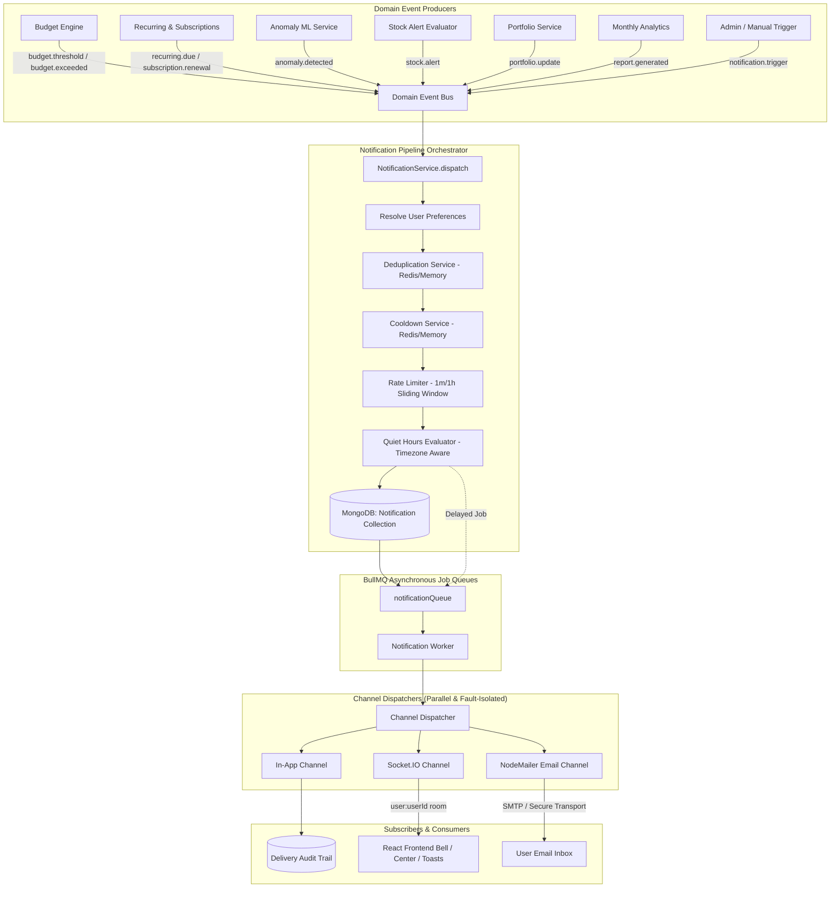

# Enterprise Notification & Alert System Architecture

SmartFin AI features an event-driven, multi-channel, enterprise-grade notification and alert system designed for ultra-low latency delivery, reliable deduplication, intelligent anti-spam cooldowns, timezone-aware quiet hours, and zero continuous frontend polling.

---

## 1. System Overview & Architecture



---

## 2. Notification Types & Priority Hierarchy

The system defines 8 enterprise event types across four standardized severity tiers:

| Type Key | Description | Default Severity | Default Channels |
| :--- | :--- | :--- | :--- |
| `BUDGET_THRESHOLD` | Spending reaches 80% of budget limit | `WARNING` | In-App, Socket.IO |
| `BUDGET_EXCEEDED` | Spending exceeds 100% of budget limit | `ALERT` | In-App, Socket.IO, Email |
| `RECURRING_PAYMENT_DUE` | Bill due within 3 days or 1 day | `INFO` / `ALERT` | In-App, Socket.IO, Email |
| `SUBSCRIPTION_RENEWAL` | Active subscription renewing soon | `INFO` | In-App, Socket.IO, Email |
| `ANOMALY_DETECTED` | Machine learning flagged spending anomaly | `ALERT` / `CRITICAL` | In-App, Socket.IO, Email |
| `STOCK_ALERT` | Stock price crosses user threshold | `INFO` / `ALERT` | In-App, Socket.IO, Email |
| `PORTFOLIO_UPDATE` | Daily portfolio change digest | `INFO` | In-App, Socket.IO |
| `MONTHLY_REPORT` | Monthly financial intelligence report | `INFO` | In-App, Email |
| `SYSTEM` | Account security or maintenance announcement | `INFO` / `CRITICAL` | In-App, Socket.IO, Email |

### Severity Levels
- **`CRITICAL`**: Immediate delivery required; unconditionally bypasses quiet hours; high-priority BullMQ queue.
- **`ALERT`**: Important threshold crossing or security risk; sends email and real-time push.
- **`WARNING`**: Threshold advisory; sends in-app and real-time push.
- **`INFO`**: Informational update or digest.

---

## 3. Intelligence & Anti-Spam Pipeline

### 3.1. Deduplication Service
- Deterministic keys formatted as:
  `dedup:{userId}:{type}:{entityType}:{entityId}:{discriminator}`
- Deduplication TTLs:
  - Budget alerts: 24 hours per period
  - Recurring / subscription reminders: 24 hours per bill due date
  - Monthly reports: 25 days per month
  - Stock alerts: Configurable cooldown period (default 1 hour)
- Prevents redundant notifications when transactions are queried or recalculated multiple times.

### 3.2. Cooldown Service
- Tracks last trigger time per user and asset/identifier (e.g. `cooldown:{userId}:stock:{symbol}`)
- Prevents market price fluctuation chatter and repeated notifications.
- Configurable per user (`minCooldownMinutes`, default 15 minutes) or per stock alert (`cooldownMinutes`).

### 3.3. Rate Limiter Service
- Sliding-window counter in Redis/Memory Cache: `ratelimit:notif:{userId}:{minute}`
- Enforces user limits (default 10 per minute, max 30-60 per hour) to protect against notification floods.

### 3.4. Timezone-Aware Quiet Hours
- Allows users to designate sleep or focus periods (e.g., `22:00` to `08:00` in `America/New_York`).
- Non-critical alerts arriving during quiet hours are scheduled with a BullMQ job delay until quiet hours elapse.
- **Critical alerts (`CRITICAL`) always bypass quiet hours** for safety.

---

## 4. Multi-Channel Delivery Engine

1. **In-App Channel**:
   - Persists notification with status `DELIVERED`.
   - Records delivery audit in `NotificationDelivery` collection.
   - Provides unread badge counts.

2. **Socket.IO Real-Time Channel**:
   - Authenticated WebSocket connection using JWT tokens in `socket.handshake.auth.token`.
   - Joins private room `user:{userId}`.
   - Emits `notification:received` and `notification:unread_count` on arrival.
   - Eliminates frontend polling completely.

3. **Email Channel (NodeMailer)**:
   - Configurable SMTP transport (`SMTP_HOST`, `SMTP_PORT`, `SMTP_USER`, `SMTP_PASS`, `SMTP_SECURE`, `SMTP_FROM`).
   - Generates responsive dark-mode HTML email templates with call-to-action buttons.
   - Resilient development fallback (mock transport) when offline or in test environments.

---

## 5. REST API Endpoints

All endpoints require JWT Bearer authentication header: `Authorization: Bearer <token>`.

### 5.1. List Notifications
- **`GET /api/v1/notifications`**
- **Query Parameters**:
  - `type`: filter by `NotificationType` (e.g. `BUDGET_EXCEEDED`)
  - `severity`: filter by `INFO`, `WARNING`, `ALERT`, `CRITICAL`
  - `isRead`: boolean (`true` or `false`)
  - `isDismissed`: boolean (default `false`)
  - `page`: integer (default `1`)
  - `limit`: integer (default `20`)

### 5.2. Unread Count
- **`GET /api/v1/notifications/unread-count`**
- **Response**: `{ "success": true, "data": { "unreadCount": 3 } }`

### 5.3. Mark as Read
- **`PATCH /api/v1/notifications/:id/read`**: Marks single notification as read.
- **`PATCH /api/v1/notifications/read-all`**: Marks all active notifications as read.

### 5.4. Dismiss / Delete
- **`PATCH /api/v1/notifications/:id/dismiss`**: Dismisses notification from active lists.
- **`DELETE /api/v1/notifications/:id`**: Soft-deletes notification.

### 5.5. Notification Preferences
- **`GET /api/v1/notifications/preferences`**: Returns full preference matrix, quiet hours, and cooldown settings.
- **`PATCH /api/v1/notifications/preferences`**:
  ```json
  {
    "emailAlerts": true,
    "pushAlerts": true,
    "stockAlertsEnabled": true,
    "minCooldownMinutes": 15,
    "quietHours": {
      "enabled": true,
      "startTime": "22:00",
      "endTime": "08:00",
      "timezone": "America/New_York"
    },
    "channels": {
      "BUDGET_THRESHOLD": { "inApp": true, "email": false, "socket": true },
      "BUDGET_EXCEEDED": { "inApp": true, "email": true, "socket": true }
    }
  }
  ```

### 5.6. Dev / Testing Trigger
- **`POST /api/v1/notifications/test`**: Dispatches test notification through all configured channels.

---

## 6. Frontend Components

- **`<NotificationBell />`**: Live header badge with real-time WebSocket connection dot, animated pulsing ping indicator, and dropdown popover.
- **`<NotificationToaster />`**: Glassmorphic floating toast alerts with severity color-coding, animated entrance, and auto-dismiss.
- **`/notifications` (`<NotificationsPage />`)**: Enterprise Notification Center with type filters, severity dropdowns, batch read actions, and test alert trigger.
- **`/settings/notifications` (`<NotificationPreferencesPage />`)**: Granular channel matrix toggles, quiet hours scheduler, and rate limiter controls.
