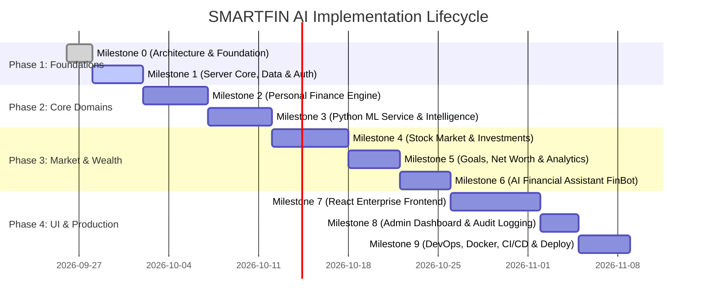

# SMARTFIN AI — Phased Implementation Roadmap

**Enterprise Personal Finance & Investment Intelligence Platform**  
*Document Version: 1.0.0 | Status: Active Engineering Roadmap*

---

## 1. Roadmap Architecture & Delivery Methodology

This roadmap breaks down the construction of **SMARTFIN AI** into 10 decoupled, milestone-driven phases (Milestone 0 through Milestone 9). Each milestone contains:
- **Core Objectives**: Exact business and functional deliverables mapped to platform goals.
- **Key Technical Tasks**: Granular engineering components to build.
- **Dependencies**: Prerequisites required prior to starting.
- **Definition of Done (DoD)**: Concrete verification criteria that must pass before progression.

---

## 2. Milestone Breakdown

### Milestone 0: Architecture, Foundation & Specifications (CURRENT)
- **Status**: Completed / Baseline Approved
- **Objectives**:
  - Perform repository inspection and initialize project workspace.
  - Define system architecture, data models, API endpoints, ML architecture, and security policies.
  - Establish monorepo/multi-service directory layout and environment variable schemas.
- **Deliverables**:
  - `docs/ARCHITECTURE.md` (System design, component diagrams, communication flows)
  - `docs/ROADMAP.md` (Phased milestones, DoD, dependencies)
  - `docs/DATABASE.md` (Mongoose schema definitions, relational integrity, index design)
  - `docs/API.md` (RESTful contracts, request/response envelopes, error codes)
  - `docs/ML_ARCHITECTURE.md` (ML pipelines, feature engineering, models, evaluation)
  - `docs/SECURITY.md` (Threat modeling, RBAC, encryption, secret hygiene)
  - Root configuration (`.gitignore`, `.editorconfig`, monorepo workspace `package.json`, environment templates)
- **Definition of Done**:
  - Complete architectural alignment; all 27 core objectives mapped to architectural components.
  - Clean directory structure in place without premature or placeholder code.

---

### Milestone 1: Server Core, Persistence & Authentication Engine
- **Objectives**:
  - Set up Node.js/Express with TypeScript in strict mode (`apps/server`).
  - Establish resilient MongoDB connection with connection pooling and Mongoose models.
  - Establish Redis connection for distributed caching, session tracking, and rate limiting.
  - Implement full JWT authentication with refresh-token rotation, MFA (TOTP), and RBAC middleware.
  - Build centralized error handling, request correlation tracing, and structured logging (Pino).
- **Core Endpoints / Features**:
  - `POST /api/v1/auth/register`
  - `POST /api/v1/auth/login`
  - `POST /api/v1/auth/refresh-token`
  - `POST /api/v1/auth/logout`
  - `POST /api/v1/auth/mfa/setup` & `POST /api/v1/auth/mfa/verify`
  - `GET /api/v1/auth/me`
  - Zod validation middleware for all request payloads.
  - Rate limiting using `rate-limiter-flexible` backed by Redis.
  - Audit logging middleware recording security and auth events.
- **Definition of Done**:
  - 100% TypeScript compilation with zero `any` types.
  - Endpoints covered by Supertest integration tests with 90%+ pass rate.
  - JWT rotation verified: old refresh tokens are invalidated immediately upon exchange.

---

### Milestone 2: Personal Finance Management & Ingestion Engine
- **Objectives**:
  - Account management (Checking, Savings, Credit Cards, Loans, Investments, Wallets).
  - Transaction processing engine: single transaction CRUD, bulk CSV parsing and ingestion, duplicate detection.
  - Budget tracking engine: category budgets, rollover calculation, threshold notifications.
  - Recurring transaction & subscription detection rules.
- **Core Endpoints / Features**:
  - `/api/v1/accounts`: Create, list, update, get balance summaries.
  - `/api/v1/transactions`: Paginated transaction list with advanced multi-filter (date range, categories, accounts, min/max amount, text search).
  - `/api/v1/transactions/import`: Secure multipart CSV parsing with row-by-row validation.
  - `/api/v1/categories`: Hierarchical category management (system standards + user custom).
  - `/api/v1/budgets`: Budget period creation, spending progress calculator, alerts at 80% & 100%.
  - `/api/v1/subscriptions`: Active subscription registry, projected next billing dates, total monthly cost.
- **Definition of Done**:
  - Atomic database transactions ensure balance updates match transaction insertions.
  - Duplicate transaction hash collision testing passes for CSV bulk imports.
  - Unit tests verify accurate budget spending calculations.

---

### Milestone 3: Python ML Service & Intelligence Core
- **Objectives**:
  - Stand up standalone Python 3.11 / FastAPI microservice (`apps/ml-service`).
  - Implement transaction auto-categorization pipeline (TF-IDF + XGBoost with rule-based fallback).
  - Implement spending anomaly detection engine (Isolation Forest + Z-score deviation).
  - Implement expense and cash-flow forecasting pipeline (Prophet / ARIMA / Holt-Winters).
  - Expose typed REST API endpoints secured via internal API key/HMAC authentication.
- **Core Endpoints / Features**:
  - `POST /api/v1/ml/categorize`: Predicts category and confidence score for transaction descriptions.
  - `POST /api/v1/ml/detect-anomalies`: Analyzes user transaction history and scores outliers.
  - `POST /api/v1/ml/forecast-expenses`: Forecasts next 30/60/90 days expenses with confidence intervals.
  - `POST /api/v1/ml/forecast-cashflow`: Projects net cash runway based on historical paydays and burn rate.
- **Definition of Done**:
  - Microservice boots independently and passes Pytest suite.
  - Categorization achieves >85% F1-score on benchmark transaction datasets.
  - Node.js backend seamlessly consumes ML endpoints with timeout and fallback logic.

---

### Milestone 4: Stock Market Integration & Investment Portfolio Engine
- **Objectives**:
  - Build external market data adapter (Finnhub / AlphaVantage / Yahoo Finance) with Redis caching.
  - Implement circuit breakers to protect against third-party rate limits and API outages.
  - Build stock watchlist with customizable target price alerts.
  - Implement investment portfolio tracker: positions, average cost basis, realized/unrealized P&L.
  - Real-time stock quote streaming via Socket.IO.
  - Machine learning stock price trend & volatility model (LSTM / XGBoost directional classifier).
- **Core Endpoints / Features**:
  - `/api/v1/market/quote/:symbol`: Real-time stock quote with 60s Redis cache.
  - `/api/v1/market/history/:symbol`: Historical OHLCV bars (1D, 1W, 1M, 1Y, 5Y).
  - `/api/v1/watchlists`: Watchlist creation and symbol tracking.
  - `/api/v1/investments/portfolios`: Portfolio management and asset allocation breakdown.
  - `/api/v1/investments/trades`: Trade order execution logging (`BUY`, `SELL`, `DIVIDEND`).
  - `/api/v1/alerts/stock`: Price threshold alert creation; background evaluation worker.
- **Definition of Done**:
  - Accurate P&L calculation verified with test cases covering multiple purchase lots and partial sales.
  - Circuit breaker trips gracefully when third-party provider returns 429 or 5xx.
  - WebSocket clients receive ticker updates without memory leaks.

---

### Milestone 5: Financial Goals, Net Worth Tracking & Advanced Analytics
- **Objectives**:
  - Financial goals management with milestone tracking and dynamic target completion forecasts.
  - Net worth engine: daily/monthly snapshot generator aggregating all assets and liabilities.
  - Advanced financial analytics: savings rate, debt-to-income ratio, monthly burn rate, category heatmaps.
  - Background cron jobs (BullMQ) for automated daily snapshot calculation and recurring alert dispatch.
- **Core Endpoints / Features**:
  - `/api/v1/goals`: Goal CRUD, milestone updates, linked savings account assignment.
  - `/api/v1/analytics/net-worth`: Historical net worth curve with asset vs. liability breakdown.
  - `/api/v1/analytics/spending-trends`: Month-over-month category variance and insights.
  - `/api/v1/analytics/financial-health`: Consolidated financial wellness score (0-100).
- **Definition of Done**:
  - Daily snapshots generated idempotently by BullMQ without duplicating records.
  - Financial health score formula validated against industry personal finance benchmarks.

---

### Milestone 6: AI Financial Assistant (FinBot) & Conversational Advisory
- **Objectives**:
  - Build conversational AI assistant endpoint supporting natural language financial queries.
  - Implement Financial RAG (Retrieval-Augmented Generation) context builder that pulls user balances, budget status, and recent transactions without leaking cross-user data.
  - Intent classification for financial actions (e.g., "How much did I spend on dining out last week?", "Can I afford a $500 flight?").
  - Guardrails preventing unauthorized financial actions or speculative stock purchase recommendations.
- **Core Endpoints / Features**:
  - `POST /api/v1/assistant/chat`: Conversational message input and streamed or JSON response.
  - `GET /api/v1/assistant/history`: Paginated conversation session history.
  - `DELETE /api/v1/assistant/history`: Privacy-compliant conversation clearing.
- **Definition of Done**:
  - Assistant answers queries strictly using the authenticated user's isolated financial data.
  - Out-of-bounds questions (e.g. general chit-chat or illegal financial advice) gracefully handled.

---

### Milestone 7: Modern Enterprise Frontend (React, Vite & Tailwind)
- **Objectives**:
  - Scaffold React 18+ application with TypeScript, Vite, Tailwind CSS, and React Router (`apps/client`).
  - Build responsive SaaS layout: collapsible sidebar, command palette (Cmd+K), notification bell, dark/light theme toggle.
  - Build interactive financial dashboards using ECharts & Recharts:
    - Net worth growth chart (area gradient).
    - Monthly cash-flow bar chart (income vs. expense).
    - Expense breakdown donut with interactive slices.
    - Portfolio asset allocation and stock candlestick charts with technical indicators.
  - Develop robust form workflows using React Hook Form + Zod for transaction creation, budget setting, and trade execution.
  - Build AI Assistant interactive slide-over drawer with chat message history.
- **Definition of Done**:
  - Zero TypeScript compile errors with strict mode enabled.
  - Lighthouse accessibility and performance score > 90.
  - Real-time quote updates animate smoothly without re-rendering parent dashboard components.

---

### Milestone 8: Admin Dashboard, Audit & Compliance Center
- **Objectives**:
  - Build administrative portal restricted to `SUPER_ADMIN` and `COMPLIANCE_OFFICER` roles.
  - User management: account lockout, password reset trigger, role assignment.
  - Audit log explorer with full-text search, IP filtering, and exportable compliance reports.
  - System telemetry: BullMQ job queue health, API response latency, active WebSocket connections, ML microservice status.
- **Core Endpoints / Features**:
  - `/api/v1/admin/users`: User list, status toggle, role modification.
  - `/api/v1/admin/audit-logs`: Filterable immutable audit trail.
  - `/api/v1/admin/system-health`: CPU, memory, database pool, and queue metrics.
- **Definition of Done**:
  - Strict RBAC enforcement verified: non-admin users receive 403 Forbidden.
  - Audit logs are immutable (read-only endpoints, no updates or deletes permitted).

---

### Milestone 9: Production Hardening, Dockerization, CI/CD & Cloud Readiness
- **Objectives**:
  - Multi-stage Dockerfiles for client, server, and ML service minimizing production image size.
  - `docker-compose.yml` for unified local development and `docker-compose.prod.yml` for production-like staging.
  - GitHub Actions CI/CD workflows:
    - Linting & type checking.
    - Automated unit and integration test runs with test MongoDB and Redis services.
    - Docker container builds and vulnerability scans (Trivy).
  - AWS deployment readiness: ECS/Fargate task definitions, environment secret integration via AWS Secrets Manager, and Nginx reverse proxy configuration with TLS.
  - Prometheus metrics exporter and health check endpoints (`/health`, `/ready`).
- **Definition of Done**:
  - Single command `docker compose up --build` spins up the entire functional platform.
  - GitHub Actions pipeline runs and passes cleanly on pull requests.
  - Zero high or critical CVEs detected in production Docker images.
