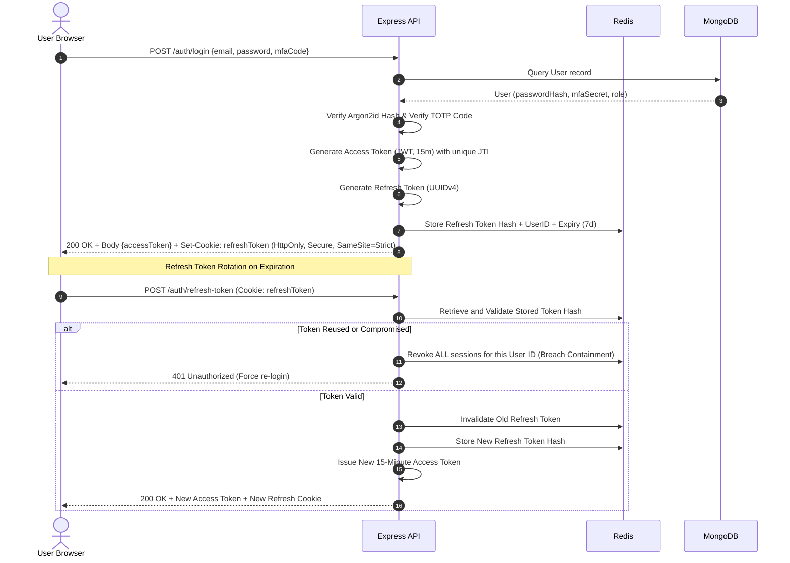

# SMARTFIN AI — Security Architecture & Threat Defense Blueprint

**Enterprise Personal Finance & Investment Intelligence Platform**  
*Document Version: 1.0.0 | Status: Approved Security Standard*

---

## 1. Security Philosophy & Zero-Trust Posture

Handling sensitive personal financial data, investment portfolios, and transaction records demands a banking-grade security architecture. **SMARTFIN AI** adopts a **Zero-Trust Architecture (ZTA)** governed by three core tenets:
1. **Never Trust, Always Verify**: Every request—whether originating from the public Internet, an internal worker, or the Python ML microservice—is authenticated, authorized, and logged.
2. **Least Privilege Enforcement**: Users, services, and database connections are granted only the minimum permissions required to perform their discrete functions.
3. **Defense-in-Depth**: Security controls are applied at multiple layers: network edge, application gateway, transport layer, business logic, persistence store, and data-at-rest.

---

## 2. Threat Modeling & Mitigation Matrix (OWASP & STRIDE)

| Threat Category | Potential Attack Vector | Platform Countermeasure |
| :--- | :--- | :--- |
| **Spoofing Identity** | Stolen credentials, credential stuffing, session hijacking | Argon2id password hashing, mandatory TOTP MFA support, short-lived JWTs (15 min), single-use refresh token rotation with reuse detection, IP pinning. |
| **Tampering with Data**| Manipulating transaction amounts or modifying another user's budget | Strict tenant isolation via Mongoose middleware (ownership verification on every query), multi-document ACID transactions, cryptographic deduplication hashes. |
| **Repudiation** | Denying initiating a trade or deleting a financial account | Immutable, append-only `AuditLog` collection capturing actor ID, timestamp, IP address, user agent, action type, and before/after diffs. |
| **Information Disclosure** | PII leakage via logs, unencrypted database backups, or API errors | Field-level AES-256-GCM encryption for bank account numbers and MFA secrets; automatic PII scrubbing in logging streams; generic production error messages. |
| **Denial of Service (DoS)** | Exhausting API connections or brute-forcing endpoints | Multi-tier sliding window rate limiting backed by Redis; request body size limits; connection timeouts; circuit breakers on third-party APIs. |
| **Elevation of Privilege** | Normal user attempting to access admin or compliance endpoints | Hierarchical Role-Based Access Control (RBAC) enforced via declarative route middleware with strict role boundary checks. |

---

## 3. Authentication & Session Architecture



### 3.1 Cryptographic Password Hashing
- **Algorithm**: `Argon2id` (the winner of the Password Hashing Competition).
- **Parameters**: Memory: 64 MB (`65536 KiB`), Iterations: 3, Parallelism: 4.
- Resists GPU-based and ASIC-based brute force attacks.

### 3.2 Token Lifecycle & Revocation
- **Access Token**: JSON Web Token (JWT) signed with RSA-256 or HMAC-SHA256 (minimum 256-bit secret). Lifetime: **15 minutes**. Contains `sub` (userId), `role`, `jti` (unique token ID), and `exp`.
- **Refresh Token**: Cryptographically secure random UUIDv4 stored as a SHA-256 hash in Redis with a 7-day TTL.
- **Immediate Revocation**: Logout and password changes immediately write the token `jti` to a Redis blacklist with a TTL equal to the remaining access token lifetime.

---

## 4. Role-Based Access Control (RBAC) Matrix

The system implements strict declarative RBAC middleware:

```typescript
export enum UserRole {
  USER = 'USER',                           // Standard personal finance user
  PREMIUM_USER = 'PREMIUM_USER',           // Advanced ML forecasting & unlimited watchlists
  FINANCIAL_ANALYST = 'FINANCIAL_ANALYST', // Read-only access to anonymized market trends
  COMPLIANCE_OFFICER = 'COMPLIANCE_OFFICER',// Read-only access to audit logs and security events
  SUPER_ADMIN = 'SUPER_ADMIN',             // Full system administration & user management
}
```

### 4.1 Permission Hierarchy Table
| Module / Capability | `USER` | `PREMIUM_USER` | `FINANCIAL_ANALYST` | `COMPLIANCE_OFFICER` | `SUPER_ADMIN` |
| :--- | :---: | :---: | :---: | :---: | :---: |
| Personal Accounts & Transactions | Own Only | Own Only | None | None | None (Strict Privacy)|
| Standard Budgeting & Goals | Own Only | Own Only | None | None | None |
| Basic Market Watchlist (Up to 5) | Yes | Yes | Yes | Yes | Yes |
| Advanced ML Price Forecasting | No | Yes | Yes | No | Yes |
| Full Audit Log Explorer | No | No | No | Read-Only | Read-Only |
| User Suspension / Role Modification| No | No | No | No | Yes |
| System Health & Metrics Inspection | No | No | No | No | Yes |

### 4.2 Tenant Isolation Rule
Controllers and services must verify resource ownership at the query level. It is forbidden to query by resource ID alone without the user ID context:
```typescript
// SECURE PATTERN
const transaction = await Transaction.findOne({ _id: txId, userId: req.user.id });
if (!transaction) throw new NotFoundError('Transaction not found');

// FORBIDDEN INSECURE PATTERN (Vulnerable to IDOR)
const transaction = await Transaction.findById(txId);
```

---

## 5. Field-Level Encryption for Sensitive Financial Data

Sensitive columns (bank account numbers, Plaid access tokens, broker API credentials, TOTP secrets) are encrypted before persisting to MongoDB using **AES-256-GCM** with an authenticated initialization vector (IV) and authentication tag.

```typescript
import crypto from 'crypto';

const ALGORITHM = 'aes-256-gcm';
const IV_LENGTH = 16;
const TAG_LENGTH = 16;

export function encryptField(plainText: string, masterKeyHex: string): string {
  const masterKey = Buffer.from(masterKeyHex, 'hex');
  const iv = crypto.randomBytes(IV_LENGTH);
  const cipher = crypto.createCipheriv(ALGORITHM, masterKey, iv);
  
  let encrypted = cipher.update(plainText, 'utf8', 'hex');
  encrypted += cipher.final('hex');
  const authTag = cipher.getAuthTag();

  // Serialized format: iv:authTag:encryptedPayload
  return `${iv.toString('hex')}:${authTag.toString('hex')}:${encrypted}`;
}

export function decryptField(cipherPayload: string, masterKeyHex: string): string {
  const [ivHex, authTagHex, encrypted] = cipherPayload.split(':');
  const masterKey = Buffer.from(masterKeyHex, 'hex');
  const decipher = crypto.createDecipheriv(ALGORITHM, masterKey, Buffer.from(ivHex, 'hex'));
  
  decipher.setAuthTag(Buffer.from(authTagHex, 'hex'));
  let decrypted = decipher.update(encrypted, 'hex', 'utf8');
  decrypted += decipher.final('utf8');
  return decrypted;
}
```

---

## 6. HTTP & Network Security Middleware

The Express application must apply the following security middleware stack:

1. **Helmet**:
   - `Content-Security-Policy` (CSP) configured to prevent inline script execution and unauthorized framing.
   - `Strict-Transport-Security` (HSTS): Enforces HTTPS with `max-age=31536000; includeSubDomains; preload`.
   - `X-Content-Type-Options: nosniff`.
   - `X-Frame-Options: DENY` (Anti-Clickjacking).
2. **CORS Policy**:
   - Explicit origin whitelisting (`ALLOWED_ORIGINS`).
   - `credentials: true`.
   - Allowed methods restricted to `GET, POST, PUT, PATCH, DELETE, OPTIONS`.
3. **Mongo Query Sanitization**:
   - `express-mongo-sanitize` strips out any keys containing `$` or `.` from request bodies to neutralize NoSQL injection attacks.
4. **Distributed Rate Limiting**:
   - Implemented via `rate-limiter-flexible` with a Redis backend.
   - Global API limit: 120 requests/minute per IP.
   - Sensitive auth endpoints (`/auth/login`, `/auth/register`, `/auth/mfa/*`): 5 requests/minute per IP with exponential lockout.

---

## 7. PII Sanitization & Audit Logging

### 7.1 Automatic Log Redaction
The application's `pino` logger is configured with redaction paths to prevent accidental logging of credentials:
```typescript
const logger = pino({
  redact: {
    paths: [
      'req.headers.authorization',
      'req.headers.cookie',
      'password',
      'passwordHash',
      'mfaSecret',
      'accountNumberMasked',
      'ssn',
      'token',
      'refreshToken'
    ],
    censor: '[REDACTED_PII]',
  },
});
```

### 7.2 Immutable Audit Trail
The `audit_logs` collection is write-only from the application layer. No update or delete operations are exposed or permitted via the API. Any administrative modification of user accounts, privilege escalations, or data exports is recorded with high-resolution timestamps.
